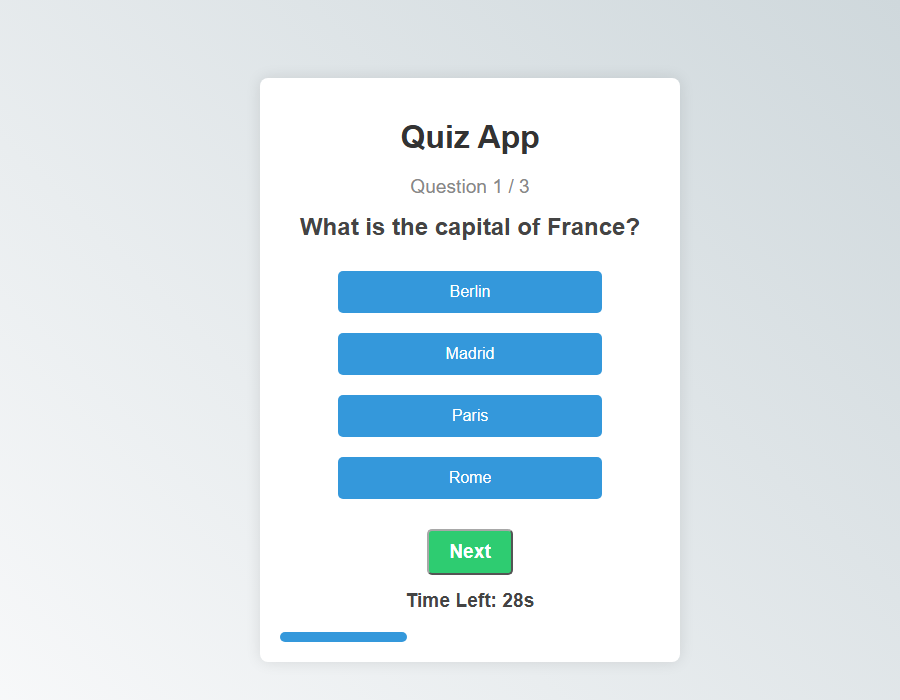

# Quiz App

**A timed multiple-choice quiz built with React: pick an answer, get instant feedback, and see your score at the end.**




## Features

- 30-second timer per question; when it runs out the question counts as unanswered and the quiz moves on
- Instant feedback ("Correct!" or the right answer) before the next question
- Progress bar and question counter
- Final score with a restart button
- Questions live in one data file, `src/quizData.js`, so adding more is a one-file change

## Tech stack

React (hooks: `useState`, `useEffect`, `useCallback`) · Create React App · plain CSS

## Getting started

```bash
npm install
npm start          # http://localhost:3000
npm run build      # production build in build/
```

## Project structure

```text
├── public/            # index.html, icons, manifest
└── src/
    ├── App.js         # quiz logic and UI
    ├── quizData.js    # questions, options, answers
    ├── index.js       # entry point
    └── index.css      # styles
```

## Roadmap

- More questions and categories (the data file currently has 3)
- Show the `hints` already stored with each question

## Author

Utkarsh Vaibhav · [GitHub](https://github.com/Utkarsh151-glitch) · [LinkedIn](https://www.linkedin.com/in/utkarsh-vaibhav-76aa99300/)
